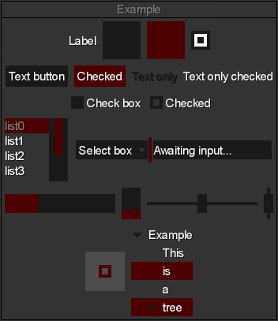
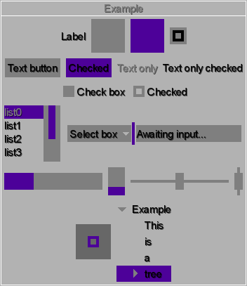

# Flat Theme

Conceptually, this skin is very similar to [Kenney pixel theme](../kenney-pixel) - instead of providing assets with a specific fixed palette, it contains *only* white drawables that you can tint however you like at runtime thanks to `TintedDrawable` utility.



To modify the theme, you just have to change `Color` values in `skin.json`:
```
        com.badlogic.gdx.graphics.Color: {
          white: { r: 1, g: 1, b: 1, a: 1 },
          gray: { r: 0.5, g: 0.5, b: 0.5, a: 1 },
          black: { r: 0, g: 0, b: 0, a: 1 },
          
          up: { r: 0.6, g: 0.6, b: 0.6, a: 1 },
          over: { r: 0.5, g: 0.5, b: 0.5, a: 1 },
          down: { r: 0, g: 0.3, b: 0.5, a: 1 },
          checked: { r: 0, g: 0.3, b: 0.5, a: 1 },
          checkedOver: { r: 0, g: 0.4, b: 0.6, a: 1 },
          disabled: { r: 0.1, g: 0.1, b: 0.1, a: 1 },
          background: { r: 0.8, g: 0.8, b: 0.8, a: 1 },
          selection: { r: 0, g: 0.3, b: 0.5, a: 1 },
          semiTransparent: { r: 0, g: 0, b: 0, a: 0.6 },
          
          font: down
          fontOver: down
          fontDown: gray
          fontChecked: checkedOver
          fontCheckedOver: checked
          fontDisabled: gray
        }
```

You can also change `TintedDrawable` settings if you want more control.

This is very convenient, as you can quickly try out different GUI themes without actually changing a single image.



Basically, this is *the ultimate prototyping skin*.

### Notes

- All default **Scene2D** actors are supported.
- This will **NOT** work on the Android by default, as Android does not support classpath fonts loading. If you target Android, copy `arial-15.fnt` and `arial-15.png` from `com.badlogic.gdx.utils` package (in the main LibGDX jar) to `com/badlogic/gdx/utils` folder in your `assets` directory.
- Being a simple skin, it features only ***14*** images. By modifying even a single drawable, you're likely to affect multiple widgets.
- This skin aims to limit nine-patch usage. Only 3 images are nine-patches: select box background and 2 alternative window backgrounds. While it should make rendering faster (which is not significant, unless you draw thousands of buttons), it does require you to set some paddings manually. In particular, you might want to use `#pad(float)` method on text buttons and `#padTop(float)` on windows with default styles. It was a conscious decision: rather than forcing a particular padding, you're free to customize your core widgets however you like.
- Additional GUI icons are not provided. However, you can use the [raw assets](raw) to add your custom icons and repack the atlas.
- All images use a single color: white. When two colors are *needed* to display the widget's gameState (for example: a checked check box), it is achieved using transparency. You have to keep that in mind and choose colors with enough contrast between them if you want to use check boxes and select boxes.
- A custom font is **not** included. While the images scale rather nicely, the default **LibGDX** font might look off when scaled. Providing a custom font should be the first thing you'd generally want to do if you plan on using this skin as your base.
- Most actors with optional backgrounds (like `Tree`, `ScrollPane`, `List`) feature at least two styles: `default` (without any background) and `background`. Default `Window` style has no top padding - it should be set manually if you want to use a window with title and to make it draggable. `Window` features tree additional styles: `resize` (features icon in bottom right row), `border` (uses transparency to fake a border) and `dialog` (hides stage underneath it with semi-transparent drawable).
- Previews were created using [LML](https://github.com/czyzby/gdx-lml/tree/master/lml). In [raw assets folder](raw/extras) you can find the LML template used to create the previews, as well as the settings of the lighter theme.
- Thanks to the fact that drawables are created at runtime, this skin allows you to prepare very responsive widgets that change their look when hovered, clicked, checked, disabled and so on. Many skin creators do not bother with preparing so many images; in this case, it was just a matter of a few JSON lines, so it required much less work.
- *Do not expect miracles.* This simple tinting mechanism is unable to create truly multi-color widgets, for example. To fully customize your theme, you might need to modify the assets manually in an image editor at some point.

### License

[CC0](https://creativecommons.org/publicdomain/zero/1.0/). You can use it without credit, although you can mention that the skin was created by **MJ** (or **Czyzby**). Posting a link to [gdx-lml](https://github.com/czyzby/gdx-lml) would also be nice.

